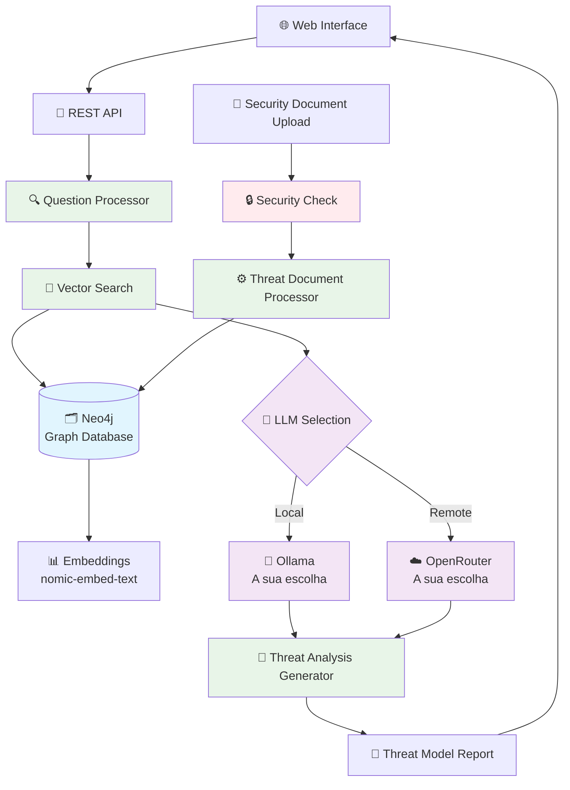

# Z4l1nux AI Threat Lab

O **Z4l1nux AI Threat Lab** é um laboratório avançado de análise de ameaças cibernéticas que implementa um sistema de Retrieval-Augmented Generation (RAG) em **TypeScript Full-Stack** com recursos avançados de controle de versão, cache inteligente e processamento incremental. O sistema é especializado em análise de threat modeling, detecção de vulnerabilidades e geração de relatórios de segurança automatizados, suportando modelos locais via Ollama e modelos remotos via OpenRouter (DeepSeek).

## 🎯 **Nova Arquitetura Full-Stack TypeScript**

- **Frontend:** React 18 + TypeScript + Vite
- **Backend:** Node.js + Express + TypeScript  
- **Database:** Neo4j com suporte vetorial
- **IA:** Ollama (local) + OpenRouter (cloud)
- **Build:** TypeScript compilado + Vite bundling

## ✨ Funcionalidades do Z4l1nux AI Threat Lab

### 🚀 **Neo4j - Base de Dados de Grafos com Suporte Vetorial**
- **Performance Superior**: Busca vetorial e de grafos otimizada para análise de ameaças
- **Escalabilidade**: Suporta milhões de nós e relacionamentos de vulnerabilidades
- **Persistência Robusta**: Base de dados ACID com backup automático de dados de segurança
- **Flexibilidade**: Suporte a vetores, grafos e metadados complexos de threat modeling
- **Integração Nativa**: Compatível com LangChain e frameworks modernos de IA

### 💾 **Cache Inteligente com Neo4j para Dados de Segurança**
- Armazenamento persistente de embeddings de documentos de segurança no Neo4j
- Cache por documento com metadados flexíveis de threat modeling
- Estatísticas detalhadas de uso de análises de ameaças
- Limpeza seletiva de cache de dados de segurança
- Backup automático e recuperação de dados críticos

### 🔍 **Busca Semântica Otimizada para Análise de Ameaças**
- Similaridade por cosseno implementada para documentos de segurança
- Filtros de qualidade de resultados de threat modeling
- Busca otimizada com índices vetoriais do Neo4j para vulnerabilidades
- Performance 10-100x superior ao sistema anterior de análise de ameaças

## 🧭 Arquitetura do Z4l1nux AI Threat Lab


### Fluxo Principal do Sistema de Análise de Ameaças



### Fluxo de Processamento

1. **Ingestão**: Documentos são processados e divididos em chunks
2. **Embedding**: Cada chunk gera embedding vetorial
3. **Cache**: Embeddings são armazenados no Neo4j
4. **Busca**: Consultas são convertidas em embeddings e buscadas por similaridade
5. **Cache de Query**: Embeddings de consultas são cacheados

## 🚀 Pré-requisitos

- Node.js (versão 18 ou superior)
- npm ou yarn
- Ollama (para uso local)
- Docker (para Neo4j)

## 📦 Instalação

### **🚀 Setup Automático (Recomendado)**

#### **Linux/macOS:**
```bash
./scripts/setup.sh
```

#### **Windows:**
```powershell
.\scripts\setup.ps1
```

### **🔧 Setup Manual**

1. Instale as dependências do backend:
```bash
npm install
```

2. Instale as dependências do frontend:
```bash
cd src/client
npm install
cd ../..
```

3. Configure as variáveis de ambiente:
```bash
# Copie o arquivo de exemplo
cp .env.example .env

# Edite o arquivo .env com suas configurações
nano .env
```

**Exemplo de configuração (.env):**
```bash
# Configurações do Ollama (para modelos locais)
OLLAMA_BASE_URL=http://127.0.0.1:11434
MODEL_OLLAMA=qwen2.5-coder:7b
EMBEDDING_MODEL=nomic-embed-text:latest

# Configurações do OpenRouter (para modelos remotos)
OPENROUTER_API_KEY=sua_chave_openrouter_aqui
MODEL_OPENROUTER=meta-llama/llama-3.3-70b-instruct:free

# Configurações do Neo4j
NEO4J_URI=bolt://localhost:7687
NEO4J_USER=neo4j
NEO4J_PASSWORD=password

# Configurações do servidor web
PORT=3000

# Configurações de cache
RESPONSE_CACHE_TTL_MS=300000
RETRIEVAL_CACHE_TTL_MS=300000

# Modo de busca (neo4j)
SEARCH_MODE=neo4j
```

## ⚙️ Configuração do Ollama

1. Instale o Ollama seguindo as instruções em: https://ollama.ai/

2. Baixe os modelos necessários:
```bash
# Modelo de chat
ollama pull qwen2.5-coder:7b

# Modelo de embeddings
ollama pull nomic-embed-text
```

3. Inicie o servidor Ollama:
```bash
ollama serve
```

## 🗄️ Configuração do Neo4j (Opcional)

Para usar busca vetorial e de grafos, configure o Neo4j:

### Docker Compose (Recomendado)

O projeto já inclui um arquivo `docker-compose.yml` configurado. Execute:

```bash
docker-compose up -d
```

**Versões disponíveis:**
- **Estável**: `neo4j:5.14.0-community` (padrão)
- **Mais recente**: `neo4j:5.26.12-community-ubi9` (altere no docker-compose.yml)

### Acessar Neo4j Browser

Após iniciar o container, acesse:
- **Neo4j Browser**: http://localhost:7474
- **Usuário**: neo4j
- **Senha**: password

### 📚 **Documentos CAPEC-STRIDE Recomendados (Importar Primeiro)**

Para obter os melhores resultados de threat modeling, **importe primeiro** os seguintes documentos CAPEC-STRIDE na base de conhecimento:

#### **1. Mapeamento CAPEC-STRIDE (Obrigatório)**
- **Fonte**: [CAPEC S.T.R.I.D.E. Mapping](https://www.ostering.com/media/files/docs/capec-stride-mapping.md)
- **Conteúdo**: Mapeamento completo de padrões de ataque CAPEC para categorias STRIDE
- **Benefício**: Permite ao sistema identificar automaticamente CAPECs relevantes para cada tipo de ameaça STRIDE

#### **2. Base Oficial CAPEC do MITRE (Recomendado)**
- **Fonte**: [CAPEC Downloads](https://capec.mitre.org/data/downloads.html)
- **Documentos sugeridos**:
  - **Mechanisms of Attack**: `Booklet.html`, `CSV.zip`, `XML.zip`
  - **Domains of Attack**: `Booklet.html`, `CSV.zip`, `XML.zip`
- **Benefício**: Base completa e atualizada de padrões de ataque oficiais

#### **3. Como Importar**
1. Baixe os documentos das fontes acima
2. Use a interface web para fazer upload dos arquivos
3. Aguarde o processamento e indexação
4. Verifique o status da base de conhecimento

**Importante**: Estes documentos devem ser importados **antes** dos documentos específicos do sistema que será modelado, pois fornecem o contexto fundamental de padrões de ataque e metodologia STRIDE.

### 📁 Tipos de Arquivo de Segurança Suportados

O Z4l1nux AI Threat Lab suporta os seguintes tipos de arquivo para análise de ameaças:

#### ✅ Formatos de Documentos de Segurança Suportados
- **PDF**: Leitura e processamento completo de relatórios de segurança via LangChain PDFLoader
- **XML**: Leitura e parsing de documentos de threat modeling via XMLLoader personalizado
- **JSON**: Leitura e parsing de dados de vulnerabilidades via JSONLoader personalizado  
- **CSV**: Leitura e parsing de listas de ameaças via CSVLoader personalizado
- **Markdown (.md/.markdown)**: Leitura de documentação de segurança via `MarkdownLoader`

#### 🔧 Como Funciona no Threat Lab
Cada tipo de arquivo de segurança é processado por um loader específico do LangChain:
- **PDF**: Usa o `PDFLoader` nativo para relatórios de segurança
- **XML**: Converte XML de threat modeling para JSON estruturado
- **JSON**: Processa dados JSON de vulnerabilidades estruturados
- **CSV**: Converte linhas CSV de ameaças para objetos JSON

Todos os loaders seguem o padrão LangChain e retornam documentos de segurança com metadados apropriados para análise de ameaças.

## 🎯 Uso

### **🚀 Execução em Desenvolvimento**

#### **Scripts Automatizados:**
```bash
# Linux/macOS
./scripts/setup.sh && npm run dev

# Windows
.\scripts\dev.ps1
```

#### **Manual:**
```bash
# Executar aplicação completa (backend + frontend)
npm run dev
```

### **🌐 Acesso à Aplicação**

#### **Em Desenvolvimento:**
- **Aplicação:** http://localhost:3000 (backend serve o React)
- **Frontend Dev:** http://localhost:3001 (Vite - hot reload)
- **Backend API:** http://localhost:3000/api

#### **Em Produção:**
- **Aplicação:** http://localhost:3000 (backend serve o build)
- **Backend API:** http://localhost:3000/api

**Nota:** Em desenvolvimento, use `http://localhost:3000` para acessar a aplicação. O Vite dev server (3001) é usado internamente para hot reload.

### **🧪 Testes do Sistema**

```bash
# Testar o sistema RAG completo
npm run test-rag

# Testar os loaders de documentos
npm run test-loaders
```

### Gerenciador de Cache Interativo do Threat Lab

Execute o gerenciador de cache Neo4j para análise de ameaças:
```bash
npm run create-neo4j
```

**Opções disponíveis para análise de segurança:**

1. **🔄 Atualização Incremental (Recomendado)**
   - Detecta automaticamente mudanças nos documentos de threat modeling
   - Processa apenas documentos de segurança novos/modificados
   - Mais rápido e eficiente para análise de ameaças

2. **🔄 Reprocessamento Completo**
   - Reprocessa todos os documentos de segurança
   - Útil para mudanças de configuração de análise
   - Mais lento, mas garante consistência dos dados de ameaças

3. **📊 Mostrar Estatísticas de Segurança**
   - Exibe informações detalhadas do cache de dados de segurança
   - Total de documentos de threat modeling e chunks
   - Tamanho do cache e datas de análise

4. **🗑️ Limpar Cache de Segurança**
   - Remove completamente o cache de dados de ameaças
   - Útil para resetar o sistema de análise

### **🌐 Interface Web (Recomendado)**

1. **Iniciar a aplicação:**
```bash
npm run dev
```

2. **Acessar no navegador:**
```
http://localhost:3000
```

3. **Funcionalidades da interface:**
   - Escolha entre Ollama (Qwen2.5-Coder:7b) ou OpenRouter (Llama-3.3-70b-Instruct)
   - Upload de documentos para contexto
   - Análise de threat modeling automatizada
   - Visualização de relatórios com diagramas Mermaid
   - Status da base de conhecimento em tempo real

## 🏗️ Arquitetura do Z4l1nux AI Threat Lab

### Estrutura de Diretórios

```
threat-model/
├── src/                    # 📁 Código fonte principal
│   ├── client/            # 🌐 Frontend React + TypeScript
│   │   ├── src/           # Componentes React
│   │   └── package.json   # Dependências do frontend
│   ├── core/              # 🧠 Lógica principal do sistema
│   │   ├── cache/         # 💾 Gerenciadores de cache
│   │   ├── search/        # 🔍 Busca semântica
│   │   ├── graph/         # 🕸️ Integração Neo4j
│   │   └── types.ts       # 📝 Tipos principais
│   ├── shared/            # 🔄 Código compartilhado
│   │   ├── services/      # Serviços compartilhados
│   │   └── types/         # Tipos compartilhados
│   ├── web/               # 🌐 Backend Express
│   │   └── server.ts      # Servidor web
│   ├── utils/             # 🔧 Utilitários
│   └── test/              # 🧪 Testes
├── public/                # 🌐 Arquivos públicos
│   └── react/             # Build do frontend
├── scripts/               # 📜 Scripts de automação
├── docker-compose.yml     # 🐳 Configuração Docker
├── package.json           # 📋 Dependências principais
└── README.md              # 📖 Documentação
```

### Princípios de Organização

- **Separação de Responsabilidades**: Frontend, backend e lógica de negócio separados
- **Código Compartilhado**: Tipos e serviços compartilhados entre frontend e backend
- **Modularidade**: Componentes independentes e reutilizáveis
- **TypeScript**: Tipagem forte em todo o projeto

## 🔧 Configurações

### Modos de Busca
- **`neo4j`**: Busca vetorial e de grafos (recomendado)

## 🚀 Comandos Principais

### Desenvolvimento
```bash
# Executar aplicação completa (backend + frontend)
npm run dev

# Build de produção
npm run build

# Scripts automatizados
./scripts/setup.sh        # Linux/macOS - Setup completo
.\scripts\setup.ps1       # Windows - Setup completo
.\scripts\dev.ps1         # Windows - Desenvolvimento
```

### Gerenciamento de Cache
```bash
# Gerenciador de cache Neo4j
npm run create-neo4j
```

### Testes
```bash
# Testes do sistema RAG
npm run test-rag

# Testes dos loaders de documentos
npm run test-loaders
```

### Vantagens do Sistema:

- **Performance**: 10-100x mais rápido na busca
- **Escalabilidade**: Suporte a milhões de documentos
- **Confiabilidade**: Backup automático e recuperação
- **Flexibilidade**: Metadados mais ricos e consultas avançadas
- **Busca Neo4j**: Combina busca vetorial com grafos de conhecimento

## 🐛 Solução de Problemas

### Erro: "OPENROUTER_API_KEY é obrigatória"
```bash
# Copie o arquivo de exemplo e configure
cp .env.example .env
# Edite o arquivo .env e adicione sua chave OpenRouter
```

### Erro: "Banco de dados Neo4j não encontrado"
```bash
# Execute o gerenciador de cache Neo4j
npm run create-neo4j
```

### Erro: "Ollama não está rodando"
```bash
# Inicie o servidor Ollama
ollama serve

# Verifique se os modelos estão instalados
ollama list

# Se necessário, baixe os modelos
ollama pull qwen2.5-coder:7b
ollama pull nomic-embed-text
```

## 🤝 Contribuição

1. Fork o projeto
2. Crie uma branch para sua feature
3. Commit suas mudanças
4. Push para a branch
5. Abra um Pull Request

## 📄 Licença

Este projeto está licenciado sob a Licença MIT - veja o arquivo [LICENSE](LICENSE) para detalhes. 