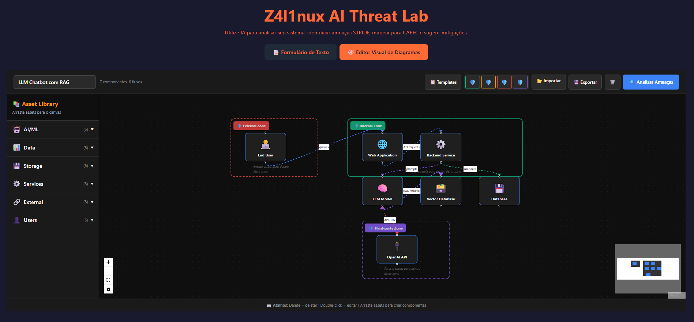
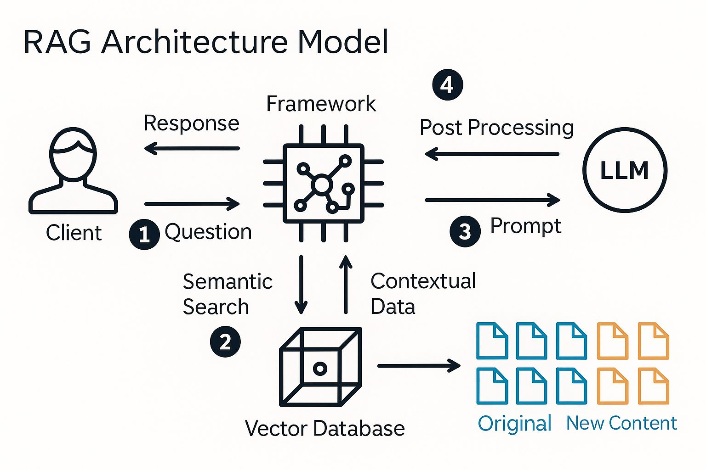

# Z4l1nux AI Threat Lab

## Descrição

Plataforma avançada de modelagem de ameaças que utiliza múltiplos provedores de IA e RAG (Retrieval-Augmented Generation) para:
- Análise STRIDE automatizada com mapeamento CAPEC
- **Editor Visual de Diagramas** (DFD drag-and-drop)
- **Detecção automática de componentes IA/ML**
- Sugestões de mitigações contextualizadas
- Relatórios completos em PDF + Árvores de Ataque

## ⚡ Novidades Principais

### 🎨 Editor Visual de Diagramas
- **Drag-and-drop** de 46 assets pré-definidos (AI/ML, Data, Storage, Services, etc.)
- **3 templates prontos**: LLM Chatbot, Web App, ML Pipeline
- **Trust Boundaries visuais**: External, Internal, DMZ, Third-party
- **Análise automática de fluxos**: Detecta cross-boundary e dados não criptografados
- **Exportação/Importação** de diagramas em JSON


*Editor visual com drag-and-drop, trust boundaries e análise automática de fluxos*

### 🤖 Threat Modeling com IA
- **Detecção automática de IA/ML**: Keywords de LLM, RAG, ML Pipeline, etc.
- **RAG com Queries Paralelas**: 5 queries simultâneas (STRIDE, componentes, tech, integrações, IA)
- **Base de conhecimento especializada**:
  - OWASP LLM Top 10 (2025)
  - AI TRiSM Framework (Gartner)
  - AI Regulations (EU AI Act, GDPR, LGPD)
  - AI Blind Spots & Challenges
- **Framework contextual**: OWASP LLM (LLM01-10) para IA, OWASP Web (A01:2021) para tradicional
- **Análise de fluxos**: Ameaças específicas para data flows e trust boundaries

## Arquitetura

### Stack Tecnológica
- **Frontend**: React 19 + TypeScript + Vite + TailwindCSS
- **Visual Editor**: ReactFlow (node-based diagrams)
- **Backend**: Node.js + Express + TypeScript
- **IA**: Ollama (local) + OpenRouter (cloud)
- **Banco de Dados**: Neo4j (vetorial + grafos)
- **RAG**: Busca semântica com embeddings + cache inteligente

### 🔌 Provedores de IA - Arquitetura Extensível

O sistema possui uma **arquitetura modular e extensível** que facilita a adição de novos providers de IA.

#### Providers Disponíveis

| Provider | Status | Geração | Embeddings |
|----------|--------|---------|------------|
| **Ollama** | ✅ Ativo | ✅ Sim | ✅ Sim |
| **OpenRouter** | ✅ Ativo | ✅ Sim | ❌ Não |
| **Gemini** | ✅ Ativo | ✅ Sim | ✅ Sim |

#### Configuração

**1. Ollama (Recomendado - Local)**
```env
OLLAMA_BASE_URL=http://172.21.112.1:11434
MODEL_OLLAMA=llama3.1:latest
EMBEDDING_MODEL_OLLAMA=nomic-embed-text:latest
OLLAMA_TIMEOUT=180000
```

**2. OpenRouter (Cloud - Fallback)**
```env
OPENROUTER_API_KEY=sk-or-v1-...
MODEL_OPENROUTER=meta-llama/llama-3.3-70b-instruct:free
EMBEDDING_MODEL_OPENROUTER=text-embedding-3-small
```

**3. Gemini (Google - Opcional)**
```env
GEMINI_API_KEY=AIza...
MODEL_GEMINI=gemini-1.5-flash
EMBEDDING_MODEL_GEMINI=text-embedding-004
```

**4. Configuração Global de Embeddings (Flexível)**
```env
# Escolha o provider de embeddings (ollama, gemini, openrouter)
EMBEDDING_PROVIDER=ollama
EMBEDDING_MODEL=nomic-embed-text:latest
```

> 💡 **Dica**: Você pode usar **providers diferentes** para geração de texto e embeddings!  
> Exemplo: `MODEL_PROVIDER=openrouter` + `EMBEDDING_PROVIDER=ollama`

#### 🚀 Adicionar Novo Provider

É extremamente simples adicionar um novo provider (Anthropic, OpenAI, Cohere, etc.):

1. **Copie o template:**
   ```bash
   cd backend/src/core/models/providers
   cp TemplateProvider.ts AnthropicProvider.ts
   ```

2. **Implemente 3 métodos:**
   - `isAvailable()` - Verifica se está configurado
   - `generateContent()` - Gera texto
   - `generateEmbedding()` - Gera embeddings (ou lança erro)

3. **Registre no ModelFactory:**
   ```typescript
   const anthropicProvider = new AnthropicProvider();
   this.registerProvider(anthropicProvider);
   ```

4. **Configure o .env:**
   ```env
   ANTHROPIC_API_KEY=sk-ant-xxxxx
   MODEL_ANTHROPIC=claude-3-5-sonnet-20241022
   ```

5. **Pronto!** O sistema detecta e usa automaticamente. 🎉

📖 **Documentação completa**: [`ARQUITETURA_PROVIDERS.md`](ARQUITETURA_PROVIDERS.md) e [`backend/src/core/models/providers/README.md`](backend/src/core/models/providers/README.md)

### Sistema RAG Avançado
- **Queries Paralelas**: 5 queries simultâneas para análise completa
- **Deduplicação inteligente**: Por chunk e versão de documento
- **Busca Vetorial**: Neo4j com índices otimizados (768 dimensões)
- **Cache com TTL**: Reduz latência em 80%
- **Formatos**: PDF, DOCX, DOC, TXT, MD, XML, JSON, CSV

## Pré-requisitos

- Node.js 18+
- Docker + Docker Compose (para Neo4j)
- **Pelo menos um provedor de IA:**
  - Ollama: Instalação local (https://ollama.ai)
  - OpenRouter: Conta + API key (https://openrouter.ai)

> **⚠️ IMPORTANTE - Arquivo de Configuração:**  
> Este projeto usa **APENAS** o arquivo `.env.local` localizado na **raiz do projeto**.  
> **NÃO** crie arquivos `.env` dentro da pasta `backend/`.  
> O backend carrega automaticamente as variáveis de `../env.local` (raiz do projeto).

## Instalação

1. **Clone o repositório:**
   ```bash
   git clone <url-do-repo>
   cd z4l1nux-ai-threat-lab
   ```

2. **Instale as dependências:**
   
   **Linux/Mac (Bash):**
   ```bash
   npm install
   ```
   
   **Windows (PowerShell):**
   ```powershell
   npm install
   ```
   
   **Ou use o script automático:**
   ```bash
   # Linux/Mac
   ./scripts/setup.sh
   
   # Windows
   .\scripts\setup.ps1
   ```

3. **Configure o `.env.local` (na raiz do projeto):**
   ```bash
   # Copie o template (se existir)
   cp .env.example .env.local
   
   # Ou crie manualmente com:
   ```
   
     ```env
   # Neo4j (OBRIGATÓRIO)
     NEO4J_URI=bolt://localhost:7687
     NEO4J_USER=neo4j
     NEO4J_PASSWORD=sua_senha_segura_aqui
     
   # Ollama (Local - Recomendado)
   OLLAMA_BASE_URL=http://localhost:11434
   MODEL_OLLAMA=llama3.1:latest
   EMBEDDING_MODEL_OLLAMA=nomic-embed-text:latest
   OLLAMA_TIMEOUT=180000
   
   # OpenRouter (Cloud - Opcional)
   OPENROUTER_API_KEY=
   MODEL_OPENROUTER=meta-llama/llama-3.3-70b-instruct:free
   EMBEDDING_MODEL_OPENROUTER=text-embedding-3-small
   
   # Gemini (Google - Opcional)
   GEMINI_API_KEY=
   MODEL_GEMINI=gemini-1.5-flash
   EMBEDDING_MODEL_GEMINI=text-embedding-004
   
   # Embedding Configuration
   EMBEDDING_PROVIDER=ollama
     EMBEDDING_MODEL=nomic-embed-text:latest
     
   # Server
   PORT=3001
   BACKEND_PORT=3001
   FRONTEND_URL=http://localhost:5173
   ```

4. **Inicie o Neo4j:**
   ```bash
   docker-compose up -d
   ```

## Uso

### Iniciar o Sistema

```bash
# Recomendado: Backend + Frontend juntos
npm run dev:full

# Ou separadamente:
npm run dev:backend  # Terminal 1
npm run dev          # Terminal 2
```

Acesse: `http://localhost:5173`

### Fluxo de Uso

#### Opção 1: Editor Visual (Recomendado para sistemas novos)

1. **Acesse a tab "Editor Visual de Diagramas"**
2. **Escolha um template** ou **arraste assets** da biblioteca
3. **Configure trust boundaries** (External, Internal, DMZ, Third-party)
4. **Conecte os componentes** (data flows)
5. **Clique em "Analisar Ameaças"** → Sistema gera análise completa

#### Opção 2: Formulário de Texto (Para sistemas existentes)

1. **Inicialize o RAG** (Painel esquerdo → "Inicializar Sistema")
2. **Faça upload da base de conhecimento:**
   - `capec-stride-mapping-completo.md` (mapeamento STRIDE-CAPEC)
   - `OWASP-LLM-Top-10.md` (ameaças LLM)
   - `AI-TRiSM-Framework.md` (framework IA)
   - Outros documentos relevantes
3. **Preencha o formulário** com descrição do sistema

### Visualizar Resultados

- **Tabela de Ameaças**: STRIDE + CAPEC + Mitigações + OWASP Top 10/LLM
- **Árvore de Ataque Interativa**: Diagrama Mermaid com zoom/pan
- **Exportar PDF**: Relatório completo para compartilhar
- **Refinar com IA**: Análise adicional contextualizada

## Funcionalidades Principais

### Editor Visual de Diagramas
- **46 Assets Pré-definidos**:
  - AI/ML: LLM Model, Vector DB, ML Pipeline, Training Data
  - Data: Database, Cache, Data Lake, Message Queue
  - Storage: Object Storage, File Storage, Backup
  - Services: Web App, Backend, Microservice, API Gateway
  - External: Third-party API, Cloud Service, CDN
  - Users: End User, Admin, Data Scientist, Developer
- **Templates Prontos**: LLM Chatbot, Web App, ML Pipeline
- **Trust Boundaries**: Visualização de zonas de confiança
- **Análise Automática**: Detecta fluxos cross-boundary e dados não criptografados

### Análise de Ameaças com IA
- **Detecção de IA/ML**: Identifica automaticamente LLM, RAG, ML, embeddings, etc.
- **STRIDE Completo**: Garante todas as 6 categorias (Spoofing, Tampering, etc.)
- **CAPEC Únicos**: 85%+ de unicidade, sem repetições
- **Framework Contextual**: 
  - OWASP LLM (LLM01-10) para componentes de IA
  - OWASP Web (A01:2021-A10:2021) para componentes tradicionais
- **Análise de Fluxos**: Ameaças específicas para data flows e trust boundaries

### Sistema RAG Avançado
- **Queries Paralelas**: 5 aspectos simultâneos (geral, componentes, tech, integrações, IA)
- **Base de Conhecimento Especializada**:
  - OWASP LLM Top 10 (2025)
  - AI TRiSM Framework (Gartner)
  - AI Regulations (EU AI Act, GDPR, LGPD)
  - CAPEC-STRIDE Mapping (400+ CAPECs)
- **Cache Inteligente**: TTL configurável, reduz latência
- **Busca Vetorial**: Neo4j com índices otimizados


*Arquitetura do sistema RAG com Neo4j, busca vetorial e cache inteligente*

## Estrutura do Projeto

```
z4l1nux-ai-threat-lab/
├── src/                        # 🎯 Código fonte principal
│   ├── frontend/               # 🎨 Frontend React
│   │   ├── src/                # Código fonte React
│   │   │   ├── components/     # Componentes React
│   │   │   ├── services/       # Serviços e APIs
│   │   │   ├── hooks/          # Custom hooks
│   │   │   ├── data/           # Dados e templates
│   │   │   ├── types/          # Definições TypeScript
│   │   │   ├── utils/          # Utilitários
│   │   │   └── __tests__/      # Testes unitários
│   │   ├── public/             # Assets estáticos
│   │   ├── dist/               # Build de produção
│   │   ├── App.tsx             # Componente principal
│   │   ├── index.html          # HTML principal
│   │   ├── index.tsx           # Entry point
│   │   ├── constants.ts        # Constantes
│   │   ├── types.ts            # Tipos TypeScript
│   │   ├── tailwind.config.js  # Config Tailwind
│   │   ├── tsconfig.json       # Config TypeScript
│   │   ├── vite.config.ts      # Config Vite
│   │   ├── vite.env.d.ts       # Tipos Vite
│   │   └── vitest.config.ts    # Config Vitest
│   ├── backend/                # 🔧 Backend Node.js
│   │   ├── src/                # Código fonte backend
│   │   │   ├── core/           # Lógica de negócio
│   │   │   ├── agents/         # Agentes de IA
│   │   │   ├── scripts/        # Scripts utilitários
│   │   │   ├── types/          # Definições TypeScript
│   │   │   └── utils/          # Utilitários
│   │   ├── dist/               # Build compilado
│   │   ├── package.json        # Dependências backend
│   │   └── tsconfig.json       # Config TypeScript
│   ├── docs/                   # 📚 Documentação
│   │   ├── README.md
│   │   ├── REACT_AGENT_INTEGRATION_COMPLETE.md
│   │   └── LICENSE
│   ├── scripts/                # 🔨 Scripts de build/deploy
│   └── knowledge-base/         # 🔗 Link simbólico para knowledge-base
├── config/                     # ⚙️ Configurações compartilhadas
├── docker-compose.yml          # 🐳 Docker Compose
├── package.json               # 📦 Root package.json
└── .env.local                 # 🔐 Variáveis ambiente
```

### 🏗️ Arquitetura Modular

O projeto segue uma **arquitetura modular** com separação clara de responsabilidades:

- **`src/`** - Pasta principal contendo todo o código fonte
- **`src/frontend/`** - Interface React com Vite
- **`src/backend/`** - API Node.js com Express
- **`src/docs/`** - Documentação do projeto
- **`src/scripts/`** - Scripts de build e deploy
- **`config/`** - Configurações compartilhadas

### 🎯 Benefícios da Estrutura

- **📁 Organização Profissional**: Seguindo melhores práticas da indústria
- **🔍 Navegação Intuitiva**: Código organizado em pastas lógicas
- **👥 Colaboração**: Estrutura clara para novos desenvolvedores
- **🔧 Manutenção**: Separação de responsabilidades
- **📦 Deploy**: Facilita deploy independente de componentes

## Testes

### Testes Unitários
```bash
npm test                # Executar testes
npm run test:ui         # Interface UI
npm run test:coverage   # Relatório de cobertura
```

### Testes de Integração
```bash
npm run test:integration  # Testes E2E
./test-rag.sh            # Testes RAG completos
```

## Documentação

### 📚 Geral
- **[ARQUITETURA_PROVIDERS.md](src/docs/ARQUITETURA_PROVIDERS.md)** - 🔌 Sistema extensível de providers de IA

### 🧪 Testes e Validação
- **[TESTES.md](src/frontend/src/__tests__/TESTES.md)** - Guia completo de testes
- **[QUERIES_NEO4J.md](src/frontend/src/__tests__/QUERIES_NEO4J.md)** - Queries Cypher úteis
- **[GUIA_RAPIDO_NEO4J.md](src/frontend/src/__tests__/GUIA_RAPIDO_NEO4J.md)** - Top 5 queries + troubleshooting
- **[VALIDACAO_RAG.md](src/frontend/src/__tests__/VALIDACAO_RAG.md)** - Evidências de funcionamento do RAG

### 🔌 Desenvolvimento de Providers
- **[backend/src/core/models/providers/README.md](src/backend/src/core/models/providers/README.md)** - Guia completo para criar providers
- **[backend/src/core/models/providers/TemplateProvider.ts](src/backend/src/core/models/providers/TemplateProvider.ts)** - Template documentado com exemplos

## Configurações Avançadas

### Timeout e Retries
```env
OLLAMA_TIMEOUT=180000        # 3 minutos (padrão)
OLLAMA_MAX_RETRIES=2         # 2 tentativas
```

Para prompts complexos, aumente o timeout:
- **Complexo**: 300s (5 min) → `OLLAMA_TIMEOUT=300000`
- **Muito Complexo**: 600s (10 min) → `OLLAMA_TIMEOUT=600000`

### Cache e Performance
```env
RESPONSE_CACHE_TTL_MS=300000   # 5 minutos (cache de respostas)
RETRIEVAL_CACHE_TTL_MS=300000  # 5 minutos (cache de embeddings)
```

## Exemplo de Prompt Completo

**Sistema:** HealthConnect

**Descrição:** Plataforma de telemedicina com:
- **Componentes:** Portal Paciente (Web/Móvel), Portal Médico, API Central, Serviços de Agendamento, Teleconsulta (WebRTC), PEP, Prescrição Digital
- **Dados:** MongoDB (perfis), PostgreSQL (dados clínicos criptografados)
- **Integrações:** Gateways de pagamento, SMS/E-mail, Assinatura digital
- **Tecnologias:** Vue.js, Flutter, Python, Golang, WebRTC, Kafka, Docker, Kubernetes (Azure)
- **Segurança:** TLS 1.3, E2E encryption, X.509 certificates
- **Dados Críticos:** Prontuários, histórico médico, CPF, credenciais, tokens de pagamento

## Licença

MIT License - Veja [LICENSE](LICENSE) para detalhes.

**Resumo:**
- ✅ Uso comercial, modificação, distribuição permitidos
- ⚠️ Sem garantias de funcionamento
- 📋 Incluir copyright e licença ao redistribuir

---

**Desenvolvido por Z4l1nux**
