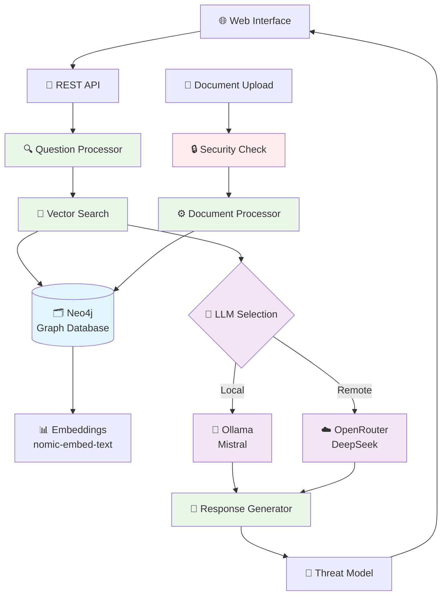

# Sistema RAG Avançado com Controle de Versão e Cache Inteligente

Este projeto implementa um sistema de Retrieval-Augmented Generation (RAG) em TypeScript com recursos avançados de controle de versão, cache inteligente e processamento incremental. Suporta modelos locais via Ollama e modelos remotos via OpenRouter (DeepSeek).

## ✨ Novas Funcionalidades Implementadas

### 🚀 **Neo4j - Base de Dados de Grafos com Suporte Vetorial**
- **Performance Superior**: Busca vetorial e de grafos otimizada
- **Escalabilidade**: Suporta milhões de nós e relacionamentos
- **Persistência Robusta**: Base de dados ACID com backup automático
- **Flexibilidade**: Suporte a vetores, grafos e metadados complexos
- **Integração Nativa**: Compatível com LangChain e frameworks modernos

### 🔄 **Processamento Incremental**
- Detecta automaticamente documentos novos, modificados ou removidos
- Processa apenas os documentos que mudaram
- Economiza tempo e recursos de processamento
- Mantém histórico de processamento

### 📊 **Controle de Versão de Documentos**
- Hash MD5 para detecção de mudanças
- Metadados completos de cada documento
- Rastreamento de data de modificação e processamento
- Versionamento automático do cache

### 💾 **Cache Inteligente com Neo4j**
- Armazenamento persistente de embeddings no Neo4j
- Cache por documento com metadados flexíveis
- Estatísticas detalhadas de uso
- Limpeza seletiva de cache
- Backup automático e recuperação

### 🔍 **Busca Semântica Otimizada**
- Similaridade por cosseno implementada
- Filtros de qualidade de resultados
- Busca otimizada com índices vetoriais do Neo4j
- Performance 10-100x superior ao sistema anterior

## 🧭 Arquitetura RAG


### Fluxo Principal do Sistema



### Sistema de Cache Inteligente

O sistema implementa um cache inteligente que resolve os seguintes problemas:

**Problemas Resolvidos:**
- ❌ Sistema consulta base JSON diretamente a cada relatório
- ❌ Sem cache, sempre gasta tokens para embeddings
- ❌ Processamento lento e custoso
- ❌ Sem otimização de performance

**Soluções Implementadas:**
- ✅ Cache inteligente com Neo4j
- ✅ Processamento incremental de documentos
- ✅ Busca semântica otimizada
- ✅ Redução significativa de tokens e tempo

### Componentes Principais

```
┌─────────────────┐    ┌──────────────────┐    ┌─────────────────┐
│   Documentos    │───▶│  Neo4j Cache     │───▶│  Busca Semântica│
│   (JSON/PDF)    │    │   (Embeddings)   │    │   (Similarity)  │
└─────────────────┘    └──────────────────┘    └─────────────────┘
                                │
                                ▼
                       ┌──────────────────┐
                       │   Query Cache    │
                       │  (Embeddings)    │
                       └──────────────────┘
```

### Fluxo de Processamento

1. **Ingestão**: Documentos são processados e divididos em chunks
2. **Embedding**: Cada chunk gera embedding vetorial
3. **Cache**: Embeddings são armazenados no Neo4j
4. **Busca**: Consultas são convertidas em embeddings e buscadas por similaridade
5. **Cache de Query**: Embeddings de consultas são cacheados

## 🚀 Pré-requisitos

- Node.js (versão 18 ou superior)
- npm ou yarn
- Ollama (para uso local)
- Docker (para Neo4j - opcional)

## 📦 Instalação

1. Instale as dependências:
```bash
npm install
```

2. Configure as variáveis de ambiente:
```bash
# Copie o arquivo de exemplo
cp .env.example .env

# Edite o arquivo .env com suas configurações
nano .env
```

**Exemplo de configuração (.env):**
```bash
# Configurações do Ollama (para modelos locais)
OLLAMA_BASE_URL=http://127.0.0.1:11434
MODEL_OLLAMA=mistral
EMBEDDING_MODEL=nomic-embed-text:latest

# Configurações do OpenRouter (para modelos remotos)
OPENROUTER_API_KEY=sua_chave_openrouter_aqui
MODEL_OPENROUTER=deepseek/deepseek-r1:free

# Configurações do Neo4j
NEO4J_URI=bolt://localhost:7687
NEO4J_USER=neo4j
NEO4J_PASSWORD=password

# Configurações do servidor web
PORT=3000

# Configurações de cache
RESPONSE_CACHE_TTL_MS=300000
RETRIEVAL_CACHE_TTL_MS=300000

# Modo de busca (neo4j)
SEARCH_MODE=neo4j
```

## ⚙️ Configuração do Ollama

1. Instale o Ollama seguindo as instruções em: https://ollama.ai/

2. Baixe os modelos necessários:
```bash
# Modelo de chat
ollama pull mistral

# Modelo de embeddings
ollama pull nomic-embed-text
```

3. Inicie o servidor Ollama:
```bash
ollama serve
```

## 🗄️ Configuração do Neo4j (Opcional)

Para usar busca vetorial e de grafos, configure o Neo4j:

### Docker Compose (Recomendado)

O projeto já inclui um arquivo `docker-compose.yml` configurado. Execute:

```bash
docker-compose up -d
```

**Versões disponíveis:**
- **Estável**: `neo4j:5.14.0-community` (padrão)
- **Mais recente**: `neo4j:5.26.12-community-ubi9` (altere no docker-compose.yml)

### Acessar Neo4j Browser

Após iniciar o container, acesse:
- **Neo4j Browser**: http://localhost:7474
- **Usuário**: neo4j
- **Senha**: password

## 📚 Preparando a Base de Conhecimento

1. Crie uma pasta chamada `base/` no diretório raiz do projeto
2. Coloque seus arquivos nesta pasta (PDF, XML, JSON, CSV)
3. Execute o gerenciador de cache Neo4j:
```bash
npm run create-neo4j
```

**Nota**: O sistema agora usa Neo4j por padrão, que oferece performance muito superior ao sistema anterior.

### 📁 Tipos de Arquivo Suportados

O sistema suporta os seguintes tipos de arquivo:

#### ✅ Formatos Suportados
- **PDF**: Leitura e processamento completo via LangChain PDFLoader
- **XML**: Leitura e parsing via XMLLoader personalizado
- **JSON**: Leitura e parsing via JSONLoader personalizado  
- **CSV**: Leitura e parsing via CSVLoader personalizado
- **Markdown (.md/.markdown)**: Leitura de conteúdo Markdown (texto puro) via `MarkdownLoader`

#### 🔧 Como Funciona
Cada tipo de arquivo é processado por um loader específico do LangChain:
- **PDF**: Usa o `PDFLoader` nativo do LangChain
- **XML**: Converte XML para JSON estruturado
- **JSON**: Processa dados JSON estruturados
- **CSV**: Converte linhas CSV para objetos JSON

Todos os loaders seguem o padrão LangChain e retornam documentos com metadados apropriados.

## 🎯 Uso

### 🧪 Testes e Verificação

Para testar os novos loaders e funcionalidades:

```bash
# Testar os loaders de XML, JSON e CSV
npm run test-loaders

# Testar o sistema RAG completo
npm run test-rag

# Testar especificamente o Neo4j
npm run test-neo4j
```

### Gerenciador de Cache Interativo

Execute o gerenciador de cache Neo4j:
```bash
npm run create-neo4j
```

**Opções disponíveis:**

1. **🔄 Atualização Incremental (Recomendado)**
   - Detecta automaticamente mudanças nos PDFs
   - Processa apenas documentos novos/modificados
   - Mais rápido e eficiente

2. **🔄 Reprocessamento Completo**
   - Reprocessa todos os documentos
   - Útil para mudanças de configuração
   - Mais lento, mas garante consistência

3. **📊 Mostrar Estatísticas**
   - Exibe informações detalhadas do cache
   - Total de documentos e chunks
   - Tamanho do cache e datas

4. **🗑️ Limpar Cache**
   - Remove completamente o cache
   - Útil para resetar o sistema

### Interface Web (Recomendado)

1. **Iniciar o servidor web:**
```bash
npm run web
```

2. **Abrir no navegador:**
```
http://localhost:3000
```

3. **Usar a interface web:**
   - Escolha entre Ollama (local) ou DeepSeek (OpenRouter)
   - Digite sua pergunta
   - Veja a resposta e logs em tempo real
   - Visualize estatísticas dos resultados

### Interface de Linha de Comando

1. **Executar o programa:**
```bash
npm run dev
```

2. **Escolher o modelo:**
   - **1 - Ollama (Local)**: Usa o modelo Mistral local via Ollama
   - **2 - DeepSeek (OpenRouter)**: Usa o modelo DeepSeek via OpenRouter

**Nota**: O sistema agora usa Neo4j por padrão para busca semântica, oferecendo performance muito superior.

## 📈 Vantagens do Novo Sistema

### ⚡ **Performance**
- Processamento incremental reduz tempo de atualização
- Neo4j oferece busca vetorial otimizada com índices nativos
- Performance 10-100x superior ao sistema anterior
- Cache local elimina dependências externas
- Busca otimizada com filtros de qualidade

### 🔒 **Confiabilidade**
- Controle de versão previne inconsistências
- Hash MD5 garante integridade dos dados
- Neo4j oferece backup automático e recuperação
- Base de dados ACID garante consistência

### 📊 **Monitoramento**
- Estatísticas detalhadas de uso
- Logs de processamento
- Rastreamento de performance

### 🛠️ **Manutenibilidade**
- Código modular e bem estruturado
- Separação clara de responsabilidades
- Fácil extensão de funcionalidades
- Neo4j oferece APIs modernas e bem documentadas
- Suporte a múltiplos backends (Neo4j, JSON, otimizado)

## 🏗️ Arquitetura do Sistema

### Estrutura de Diretórios

```
src/
├── core/                    # 🧠 Lógica principal do sistema
│   ├── cache/              # 💾 Gerenciadores de cache
│   │   └── Neo4jCacheManager.ts      # Cache Neo4j
│   ├── search/             # 🔍 Implementações de busca
│   │   ├── SearchFactory.ts          # Factory para múltiplos backends
│   │   ├── SemanticSearch.ts         # Busca tradicional
│   │   ├── OptimizedSemanticSearch.ts # Busca otimizada
│   │   └── Neo4jSemanticSearch.ts    # Busca Neo4j
│   ├── graph/              # 🕸️ Integração com Neo4j
│   │   ├── Neo4jClient.ts            # Cliente Neo4j
│   │   └── Neo4jSyncService.ts       # Sincronização com grafos
│   └── types.ts            # 📝 Tipos principais do sistema
├── cli/                    # 💻 Interfaces de linha de comando
│   ├── main.ts             # Interface principal CLI
│   ├── criarNeo4j.ts       # Gerenciador Neo4j
│   ├── reprocessNonInteractive.ts   # Reprocessamento automático
│   └── managers/           # 🛠️ Gerenciadores específicos
│       ├── criarNeo4j.ts   # Gerenciador Neo4j
│       └── buscaNeo4j.ts   # Busca Neo4j
├── web/                    # 🌐 Interface web
│   └── server.ts           # Servidor web Express
├── utils/                  # 🔧 Utilitários gerais
│   ├── fileUtils.ts        # Utilitários para arquivos
│   ├── documentLoaders.ts  # Loaders para diferentes formatos
│   ├── ProgressTracker.ts  # Rastreador de progresso
│   └── PromptTemplates.ts  # Templates de prompts
└── test/                   # 🧪 Testes
    ├── testNeo4j.ts        # Testes específicos Neo4j
    ├── testRAG.ts          # Testes do sistema RAG
    ├── testLoaders.ts      # Testes dos loaders
    ├── testPerformance.ts  # Testes de performance
    ├── testCAPECSearch.ts  # Testes de busca CAPEC
    └── testFormattedResponse.ts # Testes de resposta formatada
```

### Princípios de Organização

- **Separação de Responsabilidades**: Cada diretório tem uma função específica
- **Padrão de Nomenclatura**: PascalCase para classes, camelCase para funções
- **Organização por Funcionalidade**: Arquivos relacionados ficam próximos
- **Imports Organizados**: Relativos claros e intuitivos

## 🔧 Configurações Avançadas

### Parâmetros de Chunking
```typescript
{
  chunkSize: 2000,        // Tamanho do chunk em caracteres
  chunkOverlap: 500,      // Sobreposição entre chunks
  modelEmbedding: "nomic-embed-text:latest"  // Modelo de embedding
}
```

### Filtros de Busca
```typescript
// Similaridade mínima para resultados
scoreThreshold: 0.1

// Número máximo de resultados
maxResults: 8
```

### Modelos Disponíveis

#### Ollama (Local)
- **Chat**: mistral, llama2, codellama, etc.
- **Embeddings**: nomic-embed-text:latest

#### OpenRouter (Remoto)
- **Chat**: deepseek/deepseek-r1:free, anthropic/claude-3-haiku, etc.
- **Embeddings**: Não suportado (use Ollama)

### Modos de Busca
- **`neo4j`**: Busca vetorial e de grafos (recomendado)

## 🚀 Comandos Disponíveis

### Desenvolvimento
```bash
# Interface CLI
npm run dev

# Interface Web
npm run web

# Build
npm run build
```

### Gerenciamento de Cache
```bash
# Cache Neo4j (recomendado)
npm run create-neo4j

# Reprocessamento automático
npm run reprocess-neo4j

# Sincronização com Neo4j
npm run sync-neo4j
```

### Busca Especializada
```bash
# Busca Neo4j
npm run search-neo4j
```

### Testes
```bash
# Testes específicos
npm run test-neo4j
npm run test-rag
npm run test-loaders
npm run test-performance
npm run test-capec
npm run test-formatted
```

### Vantagens do Sistema:

- **Performance**: 10-100x mais rápido na busca
- **Escalabilidade**: Suporte a milhões de documentos
- **Confiabilidade**: Backup automático e recuperação
- **Flexibilidade**: Metadados mais ricos e consultas avançadas
- **Busca Neo4j**: Combina busca vetorial com grafos de conhecimento

## 🐛 Solução de Problemas

### Erro: "OPENROUTER_API_KEY é obrigatória"
```bash
# Copie o arquivo de exemplo e configure
cp .env.example .env
# Edite o arquivo .env e adicione sua chave OpenRouter
```

### Erro: "Banco de dados Neo4j não encontrado"
```bash
# Execute o gerenciador de cache Neo4j
npm run create-neo4j
```

### Erro: "Ollama não está rodando"
```bash
# Inicie o servidor Ollama
ollama serve

# Verifique se os modelos estão instalados
ollama list

# Se necessário, baixe os modelos
ollama pull mistral
ollama pull nomic-embed-text
```

## 📝 Logs e Debugging

O sistema gera logs detalhados para facilitar o debugging:

- **🔄 Processamento**: Status de cada etapa
- **📊 Estatísticas**: Métricas de performance
- **⚠️ Avisos**: Problemas não críticos
- **❌ Erros**: Falhas que precisam atenção

## 🤝 Contribuição

1. Fork o projeto
2. Crie uma branch para sua feature
3. Commit suas mudanças
4. Push para a branch
5. Abra um Pull Request

## 📄 Licença

Este projeto está licenciado sob a Licença MIT - veja o arquivo [LICENSE](LICENSE) para detalhes.

## 🙏 Agradecimentos

- LangChain para o framework RAG
- Neo4j para a base de dados vetorial e de grafos moderna
- Neo4j para busca vetorial e de grafos
- Ollama para modelos locais
- OpenRouter para modelos remotos
- Comunidade open source 